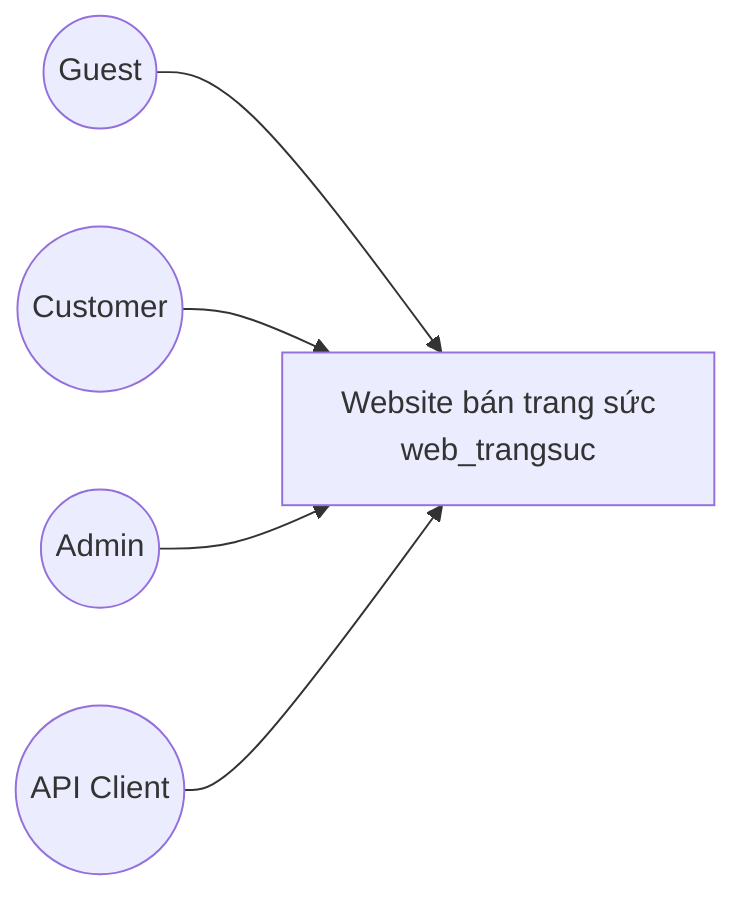
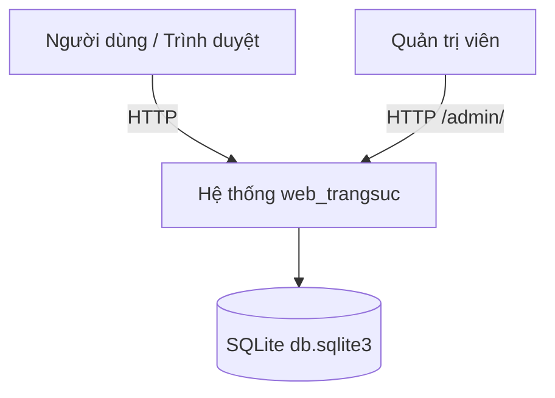
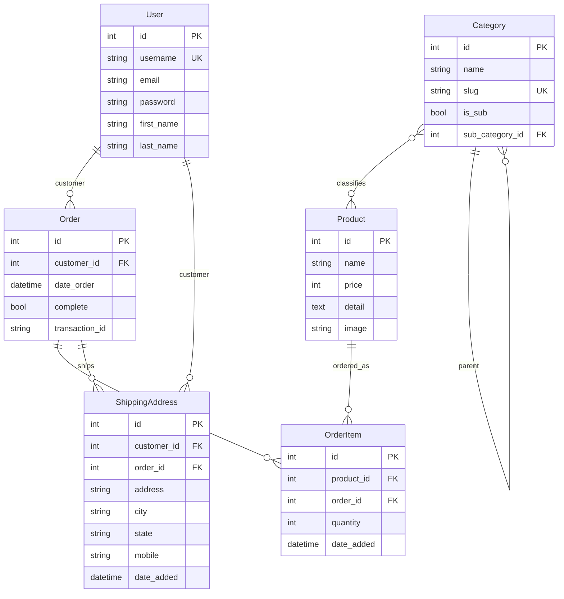
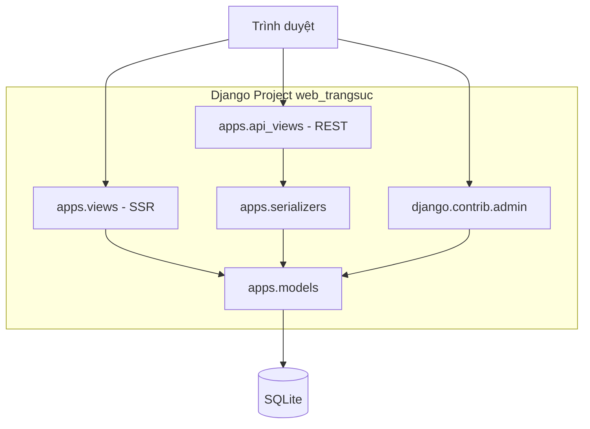
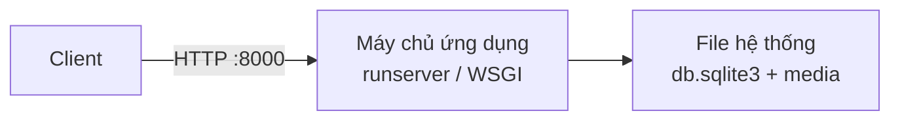
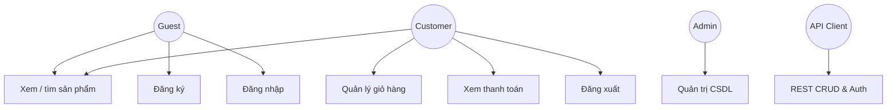
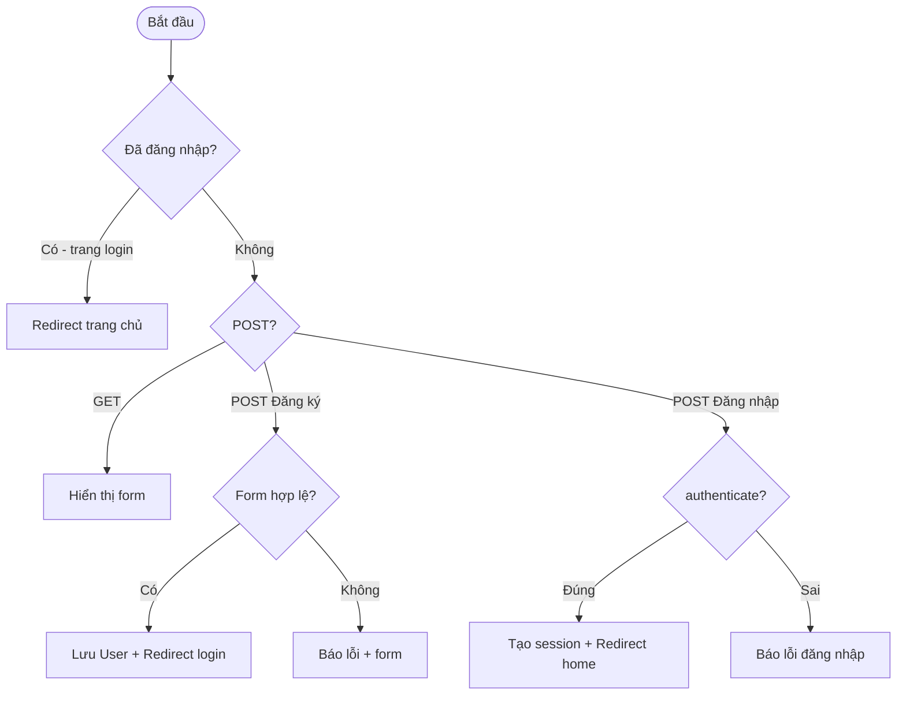
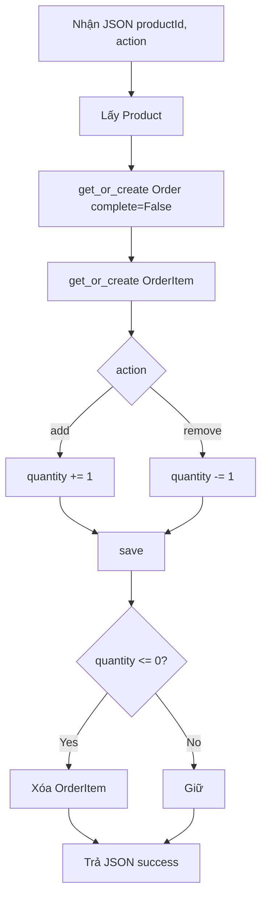
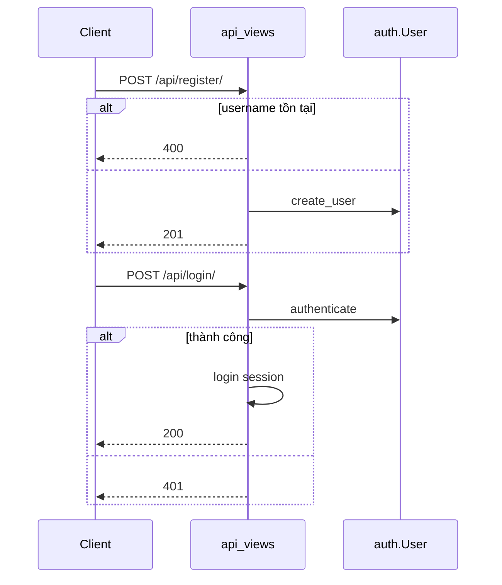

# ĐẶC TẢ YÊU CẦU PHẦN MỀM
## (Software Requirements Specification – SRS)

---

**Tên đề tài:** Xây dựng Website bán trang sức trực tuyến  
**Tên hệ thống:** Jewelry E-Commerce Web Application (`web_trangsuc`)  
**Mã dự án / Repository:** Jewelry-Other-System  
**Phiên bản tài liệu:** 3.0  
**Ngày lập:** 12/09/2026  
**Cơ sở:** Source code nhánh `main` – thư mục `website_django-main/web_trangsuc/`  

| Vai trò | Họ tên | Ghi chú |
|---|---|---|
| Sinh viên thực hiện | ……………… | Nhóm / cá nhân |
| Giảng viên hướng dẫn | ……………… | |

---

## MỤC LỤC

1. [Giới thiệu](#1-giới-thiệu)  
2. [Mô tả tổng quan hệ thống](#2-mô-tả-tổng-quan-hệ-thống)  
3. [Đặc tả yêu cầu chức năng](#3-đặc-tả-yêu-cầu-chức-năng)  
4. [Đặc tả yêu cầu phi chức năng](#4-đặc-tả-yêu-cầu-phi-chức-năng)  
5. [Đặc tả giao diện người dùng](#5-đặc-tả-giao-diện-người-dùng)  
6. [Đặc tả cơ sở dữ liệu](#6-đặc-tả-cơ-sở-dữ-liệu)  
7. [Kiến trúc hệ thống và thiết kế](#7-kiến-trúc-hệ-thống-và-thiết-kế)  
8. [Luồng xử lý và biểu đồ động](#8-luồng-xử-lý-và-biểu-đồ-động)  
9. [Ràng buộc, giả định và phạm vi loại trừ](#9-ràng-buộc-giả-định-và-phạm-vi-loại-trừ)  
10. [Ma trận truy xuất yêu cầu](#10-ma-trận-truy-xuất-yêu-cầu)  
11. [Phụ lục](#11-phụ-lục)  

---

## DANH MỤC HÌNH VẼ / SƠ ĐỒ

| Ký hiệu | Tên sơ đồ |
|---|---|
| Hình 2.1 | Biểu đồ tác nhân (Actors) |
| Hình 2.2 | Ngữ cảnh hệ thống (System context) |
| Hình 6.1 | Mô hình thực thể – quan hệ (ERD) |
| Hình 7.1 | Sơ đồ thành phần (Component) |
| Hình 7.2 | Sơ đồ triển khai (Deployment) |
| Hình 8.1 | Use case tổng quan |
| Hình 8.2 | Activity – Đăng ký / Đăng nhập |
| Hình 8.3 | Activity – Cập nhật giỏ hàng |
| Hình 8.4 | Sequence – `updateItem` |
| Hình 8.5 | Sequence – Register / Login API |

---

## DANH MỤC BẢNG

| Ký hiệu | Tên bảng |
|---|---|
| Bảng 2.1 | Phân loại người dùng |
| Bảng 3.1–3.n | Đặc tả use case chi tiết |
| Bảng 4.1 | Yêu cầu phi chức năng |
| Bảng 5.1 | Ánh xạ màn hình – URL |
| Bảng 6.1–6.6 | Mô tả các bảng CSDL |
| Bảng 10.1 | Ma trận yêu cầu → source code |

---

## THUẬT NGỮ VÀ TỪ VIẾT TẮT

| Thuật ngữ | Định nghĩa |
|---|---|
| SRS | Software Requirements Specification – Đặc tả yêu cầu phần mềm |
| SSR | Server-Side Rendering – render HTML phía máy chủ Django |
| DRF | Django REST Framework |
| ORM | Object-Relational Mapping (Django Models) |
| API | Application Programming Interface (REST JSON) |
| Session | Phiên đăng nhập phía server (Django Authentication) |
| Giỏ hàng | Bản ghi `Order` với `complete = False` của người dùng |
| Admin | Người quản trị dùng giao diện `/admin/` của Django |
| Guest | Người dùng chưa đăng nhập |
| Customer | Người dùng đã đăng ký / đăng nhập |

---

# 1. GIỚI THIỆU

## 1.1. Mục đích tài liệu

Tài liệu này đặc tả đầy đủ các yêu cầu phần mềm của hệ thống **Website bán trang sức trực tuyến**, nhằm:

1. Làm cơ sở thống nhất giữa sinh viên, giảng viên và nhóm phát triển về phạm vi sản phẩm.  
2. Phản ánh **đúng** những gì đang được hiện thực trong mã nguồn (không mô tả chức năng “dự kiến” ngoài code).  
3. Hỗ trợ thiết kế kiểm thử, bảo trì và đánh giá đồ án.

## 1.2. Phạm vi sản phẩm

Hệ thống cho phép khách hàng xem danh mục trang sức, tìm kiếm sản phẩm, đăng ký tài khoản, thêm sản phẩm vào giỏ hàng và xem trang thanh toán; đồng thời cung cấp REST API và trang quản trị Django Admin để quản lý dữ liệu.

**Mã nguồn gốc:** `website_django-main/web_trangsuc/`  
**Framework:** Django 4.2; giao diện HTML/Bootstrap/JS; CSDL SQLite (`db.sqlite3`).

## 1.3. Đối tượng sử dụng tài liệu

- Sinh viên thực hiện đồ án / báo cáo môn học.  
- Giảng viên hướng dẫn / hội đồng đánh giá.  
- Người phát triển và kiểm thử phần mềm.

## 1.4. Tài liệu tham chiếu

| STT | Tài liệu | Ghi chú |
|---|---|---|
| 1 | Source `apps/models.py`, `views.py`, `api_views.py`, `urls.py`, `settings.py` | Nguồn sự thật (source of truth) |
| 2 | Django 4.2 Documentation | https://docs.djangoproject.com/en/4.2/ |
| 3 | Django REST Framework | https://www.django-rest-framework.org/ |
| 4 | `README.md` của repository | Hướng dẫn cài đặt |

---

# 2. MÔ TẢ TỔNG QUAN HỆ THỐNG

## 2.1. Tổng quan sản phẩm

Website bán trang sức là ứng dụng web **monolith** dùng Django:

- **Tầng trình bày:** Template HTML render bởi `apps.views` (SSR).  
- **Tầng API:** Các endpoint REST tại `/api/` (`apps.api_views`).  
- **Tầng quản trị:** Django Admin tại `/admin/`.  
- **Tầng dữ liệu:** Django ORM ánh xạ xuống SQLite.

## 2.2. Phân loại người dùng

**Bảng 2.1 – Actors**

| Actor | Mô tả | Quyền chính |
|---|---|---|
| Guest | Khách chưa đăng nhập | Xem SP, tìm kiếm, đăng ký, đăng nhập |
| Customer | Người dùng đã xác thực (session) | Giỏ hàng, cập nhật số lượng, trang thanh toán, đăng xuất |
| Admin | Tài khoản `staff` / superuser | CRUD toàn bộ model qua `/admin/` |
| API Client | Ứng dụng / công cụ gọi REST | Gọi các endpoint `/api/...` |

**Hình 2.1 – Biểu đồ tác nhân**



**Hình 2.2 – Ngữ cảnh hệ thống**



## 2.3. Tóm tắt chức năng chính

1. Duyệt và tìm kiếm sản phẩm trang sức.  
2. Quản lý tài khoản: đăng ký, đăng nhập, đăng xuất.  
3. Quản lý giỏ hàng (thêm / bớt số lượng).  
4. Xem trang thanh toán (giao diện; chưa tích hợp cổng thanh toán ngoài).  
5. REST API quản lý sản phẩm, danh mục, đơn hàng, địa chỉ giao hàng.  
6. Quản trị dữ liệu qua Django Admin.

## 2.4. Môi trường vận hành

| Thành phần | Giá trị thực tế trong project |
|---|---|
| Ngôn ngữ | Python 3.10+ |
| Backend | Django == 4.2 |
| API | Django REST Framework |
| CSDL | SQLite (cấu hình mặc định trong `settings.py`) |
| Thư viện hỗ trợ | Pillow (ảnh), WhiteNoise (static), (tuỳ chọn) MySQL client trong requirements |
| Frontend | HTML5, CSS3, Bootstrap, JavaScript |
| Máy chủ phát triển | `python manage.py runserver` (cổng 8000) |

---

# 3. ĐẶC TẢ YÊU CẦU CHỨC NĂNG

Quy ước mã yêu cầu:

- **FR-WEB-xx:** Chức năng giao diện web.  
- **FR-API-xx:** Chức năng REST API.  
- **FR-ADM-xx:** Chức năng quản trị.  

Độ ưu tiên: **Cao** = đã có và là lõi nghiệp vụ; **TB** = hỗ trợ; **Thấp** = phụ trợ.

---

## 3.1. Nhóm chức năng Web (SSR)

### FR-WEB-01: Xem trang chủ

| Mục | Nội dung |
|---|---|
| Mã | FR-WEB-01 |
| Tên | Xem trang chủ |
| Actor | Guest, Customer |
| Mức ưu tiên | Cao |
| Đầu vào | HTTP GET `/` |
| Tiền điều kiện | Không |
| Xử lý | Lấy danh sách `Product`; nếu đã đăng nhập thì lấy/tạo `Order(complete=False)` và số lượng giỏ |
| Đầu ra | Render `index.html` |
| Hậu điều kiện | Không đổi CSDL (trừ lần đầu tạo giỏ rỗng khi đã login) |
| Ngoại lệ | Không |
| Source | `views.home`, URL `name='home'` |

### FR-WEB-02: Xem danh sách sản phẩm

| Mục | Nội dung |
|---|---|
| Mã | FR-WEB-02 |
| Tên | Xem danh sách sản phẩm |
| Actor | Guest, Customer |
| Ưu tiên | Cao |
| Đầu vào | GET `/product/` |
| Xử lý | Lấy `Product` và `Category(is_sub=False)` |
| Đầu ra | `show_product.html` |
| Source | `views.show_products` |

### FR-WEB-03: Lọc sản phẩm theo danh mục

| Mục | Nội dung |
|---|---|
| Mã | FR-WEB-03 |
| Tên | Lọc theo danh mục |
| Actor | Guest, Customer |
| Ưu tiên | Cao |
| Đầu vào | GET `/category/?category=<slug>` |
| Xử lý | Nếu có `category` → `Product.objects.filter(category__slug=...)`; ngược lại lấy tất cả |
| Đầu ra | `category.html` |
| Source | `views.category` |

### FR-WEB-04: Xem chi tiết sản phẩm

| Mục | Nội dung |
|---|---|
| Mã | FR-WEB-04 |
| Tên | Chi tiết sản phẩm |
| Actor | Guest, Customer |
| Ưu tiên | Cao |
| Đầu vào | GET `/detail/?id=<product_id>` |
| Xử lý | `Product.objects.filter(id=id)` |
| Đầu ra | `detail.html` |
| Source | `views.detail` |

### FR-WEB-05: Tìm kiếm sản phẩm

| Mục | Nội dung |
|---|---|
| Mã | FR-WEB-05 |
| Tên | Tìm kiếm theo tên |
| Actor | Guest, Customer |
| Ưu tiên | Cao |
| Đầu vào | POST `/search/` với trường `searched` |
| Xử lý | `Product.objects.filter(name__contains=searched)` |
| Đầu ra | `search.html` với danh sách `keys` |
| Ngoại lệ | Chuỗi rỗng → danh sách kết quả rỗng (theo hành vi template/view) |
| Source | `views.search` |

### FR-WEB-06: Xem giỏ hàng

| Mục | Nội dung |
|---|---|
| Mã | FR-WEB-06 |
| Tên | Xem giỏ hàng |
| Actor | Customer (Guest xem giỏ trống) |
| Ưu tiên | Cao |
| Đầu vào | GET `/cart/` |
| Xử lý | User đã login: `Order.get_or_create(complete=False)` + `orderitem_set`; Guest: giỏ trống |
| Đầu ra | `cart.html` |
| Source | `views.cart` |

### FR-WEB-07: Cập nhật giỏ hàng (thêm / bớt)

| Mục | Nội dung |
|---|---|
| Mã | FR-WEB-07 |
| Tên | Cập nhật số lượng sản phẩm trong giỏ |
| Actor | Customer (yêu cầu user đăng nhập trong luồng bình thường) |
| Ưu tiên | Cao |
| Đầu vào | POST `/update_item/` — JSON `{ "productId": <id>, "action": "add" \| "remove" }` |
| Tiền điều kiện | Sản phẩm tồn tại |
| Xử lý chính | get_or_create Order & OrderItem; `add` → quantity+1; `remove` → quantity−1; nếu quantity ≤ 0 → xóa OrderItem |
| Đầu ra | JSON `{ "message": "Item updated successfully" }` |
| Source | `views.updateItem` |

### FR-WEB-08: Xem trang thanh toán

| Mục | Nội dung |
|---|---|
| Mã | FR-WEB-08 |
| Tên | Hiển thị trang thanh toán |
| Actor | Customer / Guest |
| Ưu tiên | TB |
| Đầu vào | GET `/payment/` |
| Xử lý | Hiển thị thông tin order/giỏ; **không** gọi cổng thanh toán bên thứ ba trong code hiện tại |
| Đầu ra | `payment.html` |
| Source | `views.payment` |

### FR-WEB-09: Trang liên hệ

| Mục | Nội dung |
|---|---|
| Mã | FR-WEB-09 |
| Tên | Xem trang liên hệ |
| Actor | Guest, Customer |
| Ưu tiên | Thấp |
| Đầu vào | GET `/contact/` |
| Đầu ra | `contact.html` |
| Source | `views.contact` |

### FR-WEB-10: Đăng ký tài khoản

| Mục | Nội dung |
|---|---|
| Mã | FR-WEB-10 |
| Tên | Đăng ký |
| Actor | Guest |
| Ưu tiên | Cao |
| Đầu vào | GET/POST `/register/` — form: username, email, first_name, last_name, password1, password2 |
| Xử lý | `CreateUserForm`; hợp lệ → `save()` + thông báo thành công → redirect `/login/` |
| Ngoại lệ | Form invalid → thông báo lỗi, render lại form |
| Source | `views.register`, `models.CreateUserForm` |

### FR-WEB-11: Đăng nhập

| Mục | Nội dung |
|---|---|
| Mã | FR-WEB-11 |
| Tên | Đăng nhập |
| Actor | Guest |
| Ưu tiên | Cao |
| Đầu vào | GET/POST `/login/` — username, password |
| Xử lý | Nếu đã login → redirect home; POST: `authenticate` → `login` → redirect home; sai → message lỗi |
| Source | `views.loginPage` |

### FR-WEB-12: Đăng xuất

| Mục | Nội dung |
|---|---|
| Mã | FR-WEB-12 |
| Tên | Đăng xuất |
| Actor | Customer |
| Ưu tiên | Cao |
| Đầu vào | GET `/logout/` |
| Xử lý | `logout(request)` → redirect `/login/` |
| Source | `views.logoutPage` |

---

## 3.2. Nhóm chức năng REST API

### FR-API-01: Quản lý danh sách / tạo sản phẩm

| Mục | Nội dung |
|---|---|
| Mã | FR-API-01 |
| Endpoint | `/api/products/` |
| Method | GET → danh sách; POST → tạo mới |
| Đầu vào POST | JSON theo `ProductSerializer` (name, price, detail, category, image…) |
| Đầu ra | 200 (GET), 201 (POST hợp lệ), 400 (POST lỗi validate) |
| Ràng buộc | `price >= 0` (`MinValueValidator`) |
| Source | `api_views.product_list` |

### FR-API-02: Chi tiết / cập nhật / xóa sản phẩm

| Mục | Nội dung |
|---|---|
| Mã | FR-API-02 |
| Endpoint | `/api/products/<id>/` |
| Method | GET, PUT, DELETE |
| Ngoại lệ | Không tìm thấy → 404 `{ "error": "Product not found" }` |
| DELETE thành công | 204 + message |
| Source | `api_views.product_detail` |

### FR-API-03 / FR-API-04: Category list & detail

| Mã | Endpoint | Method | Ghi chú |
|---|---|---|---|
| FR-API-03 | `/api/categories/` | GET, POST | `slug` unique |
| FR-API-04 | `/api/categories/<id>/` | GET, PUT, DELETE | 404 nếu không tồn tại |

Source: `category_list`, `category_detail`.

### FR-API-05 / FR-API-06: Order list & detail

| Mã | Endpoint | Method |
|---|---|---|
| FR-API-05 | `/api/orders/` | GET, POST |
| FR-API-06 | `/api/orders/<id>/` | GET, PUT, DELETE |

### FR-API-07 / FR-API-08: OrderItem (chỉ đọc)

| Mã | Endpoint | Method |
|---|---|---|
| FR-API-07 | `/api/order-items/` | GET |
| FR-API-08 | `/api/order-items/<id>/` | GET (404 nếu không có) |

### FR-API-09 / FR-API-10: ShippingAddress

| Mã | Endpoint | Method |
|---|---|---|
| FR-API-09 | `/api/shipping-addresses/` | GET, POST |
| FR-API-10 | `/api/shipping-addresses/<id>/` | GET, PUT, DELETE |

Ràng buộc: `mobile` max_length = 10.

### FR-API-11: Đăng ký API

| Mục | Nội dung |
|---|---|
| Mã | FR-API-11 |
| Endpoint | POST `/api/register/` |
| Body | username, email, password, first_name, last_name |
| Thành công | 201 + UserSerializer (không trả password) |
| Thất bại | 400 nếu username đã tồn tại |

### FR-API-12: Đăng nhập API

| Mục | Nội dung |
|---|---|
| Mã | FR-API-12 |
| Endpoint | POST `/api/login/` |
| Thành công | 200 + message + user; tạo session |
| Thất bại | 401 Invalid username or password |

### FR-API-13: Đăng xuất API

| Mục | Nội dung |
|---|---|
| Mã | FR-API-13 |
| Endpoint | POST `/api/logout/` |
| Kết quả | 200 Logout successful (kể cả khi anonymous) |

---

## 3.3. Nhóm chức năng Admin

### FR-ADM-01: Quản trị dữ liệu hệ thống

| Mục | Nội dung |
|---|---|
| Mã | FR-ADM-01 |
| Actor | Admin |
| URL | `/admin/` |
| Chức năng | CRUD các model đã đăng ký: Product, Category, Order, OrderItem, ShippingAddress; quản lý User Django mặc định |
| Source | `apps/admin.py`, `django.contrib.admin` |

---

## 3.4. Quy tắc nghiệp vụ (Business Rules)

| Mã | Quy tắc | Hiện thực |
|---|---|---|
| BR-01 | Giá sản phẩm không âm | `MinValueValidator(0)` trên `Product.price` |
| BR-02 | Slug danh mục là duy nhất | `Category.slug` unique |
| BR-03 | Giỏ hàng = Order chưa hoàn tất | `complete=False` |
| BR-04 | Hết số lượng trong giỏ thì xóa dòng | `quantity <= 0` → `OrderItem.delete()` |
| BR-05 | Username đăng ký API không trùng | Kiểm tra `User.objects.filter(username=...).exists()` |
| BR-06 | SĐT giao hàng tối đa 10 ký tự | `ShippingAddress.mobile` max_length=10 |
| BR-07 | Danh mục có thể phân cấp | `Category.sub_category` self-FK |

---

# 4. ĐẶC TẢ YÊU CẦU PHI CHỨC NĂNG

**Bảng 4.1**

| Mã | Nhóm | Mô tả yêu cầu | Mức | Ghi chú theo project |
|---|---|---|---|---|
| NFR-01 | Hiệu năng | Thời gian phản hồi trang cơ bản < 3s trên môi trường dev (localhost) | TB | Monolith nhỏ, phù hợp demo |
| NFR-02 | Khả dụng | Hệ thống chạy ổn định khi một người dùng thao tác liên tục trên máy local | TB | SQLite single-writer |
| NFR-03 | Bảo mật | Xác thực bằng session Django; mật khẩu hash bởi framework | Cao | Có CSRF middleware cho form web |
| NFR-04 | Bảo mật cấu hình | Production cần tắt DEBUG, đổi SECRET_KEY, giới hạn ALLOWED_HOSTS | Cao | Hiện `DEBUG=True`, `ALLOWED_HOSTS=['*']` — **chưa đạt production** |
| NFR-05 | Bảo mật API | Nên kiểm soát quyền truy cập endpoint | Cao | Code hiện **chưa** gắn `permission_classes` trên DRF |
| NFR-06 | Khả năng bảo trì | Tách `views` / `api_views` / `models` / `serializers` | Cao | Đã tách trong app `apps` |
| NFR-07 | Khả năng mở rộng | Có thể chuyển sang MySQL (dependency có trong requirements) | TB | Mặc định đang dùng SQLite |
| NFR-08 | Giao diện | Hỗ trợ trình duyệt Chrome, Edge, Firefox phiên bản hiện hành | Cao | HTML/Bootstrap |
| NFR-09 | Tính di động | Giao diện dùng Bootstrap; hiển thị được trên màn hình hẹp | TB | Phụ thuộc CSS hiện có |
| NFR-10 | Journal / log | Dùng logging mặc định Django khi DEBUG | Thấp | Chưa có module audit riêng |
| NFR-11 | Sao lưu | Sao lưu bằng copy file `db.sqlite3` | Thấp | Không có UI backup |
| NFR-12 | Kiểm thử | Có thể viết unit/API test với `manage.py test` | TB | Tùy nhánh phát triển |

---

# 5. ĐẶC TẢ GIAO DIỆN NGƯỜI DÙNG

## 5.1. Nguyên tắc giao diện

- Mỗi chức năng web tương ứng một template trong `apps/templates/`.  
- Dùng CSS/JS tĩnh từ `apps/static` và thư mục collect `productionFiles`.  
- Giỏ hàng phía client tương tác qua JavaScript gọi `/update_item/`.

## 5.2. Ánh xạ màn hình

**Bảng 5.1**

| Màn hình | Template | URL | Actor |
|---|---|---|---|
| Trang chủ | `index.html` | `/` | Guest, Customer |
| Danh sách SP | `show_product.html` | `/product/` | Guest, Customer |
| Danh mục | `category.html` | `/category/` | Guest, Customer |
| Chi tiết | `detail.html` | `/detail/` | Guest, Customer |
| Tìm kiếm | `search.html` | `/search/` | Guest, Customer |
| Giỏ hàng | `cart.html` | `/cart/` | Guest, Customer |
| Thanh toán | `payment.html` | `/payment/` | Guest, Customer |
| Liên hệ | `contact.html` | `/contact/` | Guest, Customer |
| Đăng nhập | `login.html` | `/login/` | Guest |
| Đăng ký | `register.html` | `/register/` | Guest |
| Admin | Django Admin templates | `/admin/` | Admin |

## 5.3. Yêu cầu thông báo

- Đăng ký thành công: message success, chuyển login.  
- Đăng nhập sai: message “Invalid username or password.”  
- Form đăng ký lỗi: message lỗi submission.

---

# 6. ĐẶC TẢ CƠ SỞ DỮ LIỆU

## 6.1. Tổng quan

- DBMS: **SQLite** (file `db.sqlite3`).  
- ORM: Django Models trong `apps/models.py`.  
- User: dùng sẵn `django.contrib.auth.models.User`.

**Hình 6.1 – Sơ đồ ERD**



## 6.2. Mô tả chi tiết bảng

### Bảng 6.1 – Category

| Thuộc tính | Kiểu | Null | Ràng buộc | Mô tả |
|---|---|---|---|---|
| id | Integer (PK) | Không | Auto | Khóa chính |
| name | Char(200) | Có | | Tên danh mục |
| slug | Slug(200) | Không | Unique | Đường dẫn lọc |
| is_sub | Boolean | Không | Default False | Là danh mục con? |
| sub_category_id | FK → Category | Có | ON DELETE CASCADE | Danh mục cha |

### Bảng 6.2 – Product

| Thuộc tính | Kiểu | Null | Ràng buộc | Mô tả |
|---|---|---|---|---|
| id | Integer (PK) | Không | Auto | Khóa chính |
| name | Char(200) | Có | | Tên sản phẩm |
| price | Integer | Không | ≥ 0 | Đơn giá |
| detail | Text | Có | | Mô tả |
| image | ImageField | Có | | Ảnh sản phẩm |
| category | M2M → Category | | Bảng trung gian | Nhiều danh mục |

**Thuộc tính ảo:** `ImageURL` — trả về URL ảnh hoặc chuỗi rỗng.

### Bảng 6.3 – Order

| Thuộc tính | Kiểu | Null | Ràng buộc | Mô tả |
|---|---|---|---|---|
| id | Integer (PK) | Không | Auto | Mã đơn / giỏ |
| customer_id | FK → User | Có | SET_NULL | Khách hàng |
| date_order | DateTime | Không | auto_now_add | Thời điểm tạo |
| complete | Boolean | Có | Default False | Đã hoàn tất? |
| transaction_id | Char(200) | Có | | Mã giao dịch |

**Thuộc tính ảo:** `get_cart_items`, `get_cart_total`.

### Bảng 6.4 – OrderItem

| Thuộc tính | Kiểu | Null | Ràng buộc | Mô tả |
|---|---|---|---|---|
| id | Integer (PK) | Không | Auto | |
| product_id | FK → Product | Có | SET_NULL | Sản phẩm |
| order_id | FK → Order | Có | SET_NULL | Đơn / giỏ |
| quantity | Integer | Có | Default 0 | Số lượng |
| date_added | DateTime | Không | auto_now_add | |

**Thuộc tính ảo:** `get_total = price * quantity`.

### Bảng 6.5 – ShippingAddress

| Thuộc tính | Kiểu | Null | Ràng buộc | Mô tả |
|---|---|---|---|---|
| id | Integer (PK) | Không | Auto | |
| customer_id | FK → User | Có | SET_NULL | |
| order_id | FK → Order | Có | SET_NULL | |
| address | Char(200) | Có | | Địa chỉ |
| city | Char(200) | Có | | Thành phố |
| state | Char(200) | Có | | Tỉnh/Bang |
| mobile | Char(10) | Có | max 10 | Số điện thoại |
| date_added | DateTime | Không | auto_now_add | |

### Bảng 6.6 – User (Django auth)

Sử dụng bảng chuẩn `auth_user` với các trường: id, username (unique), password (hash), email, first_name, last_name, is_staff, is_superuser, is_active, last_login, date_joined.

## 6.3. Quan hệ

| Quan hệ | Loại | Diễn giải |
|---|---|---|
| User – Order | 1 – n | Một user có nhiều đơn/giỏ |
| User – ShippingAddress | 1 – n | Nhiều địa chỉ |
| Order – OrderItem | 1 – n | Nhiều dòng hàng |
| Product – OrderItem | 1 – n | Sản phẩm xuất hiện nhiều dòng |
| Product – Category | n – n | Một SP thuộc nhiều danh mục |
| Category – Category | 1 – n | Danh mục cha – con |

---

# 7. KIẾN TRÚC HỆ THỐNG VÀ THIẾT KẾ

## 7.1. Kiến trúc tổng thể

**Hình 7.1 – Component**



**Hình 7.2 – Deployment**



## 7.2. Tổ chức mã nguồn

```text
website_django-main/web_trangsuc/
├── manage.py
├── db.sqlite3
├── requirements.txt
├── Dockerfile
├── apps/
│   ├── models.py          # CSDL nghiệp vụ
│   ├── views.py           # FR-WEB-*
│   ├── urls.py
│   ├── api_views.py       # FR-API-*
│   ├── api_urls.py
│   ├── serializers.py
│   ├── admin.py           # FR-ADM-01
│   ├── templates/         # Giao diện
│   └── static/            # CSS, JS, images
└── web_trangsuc/
    ├── settings.py
    ├── urls.py            # include apps + api + admin
    ├── wsgi.py
    └── asgi.py
```

## 7.3. Định tuyến gốc

| Prefixe | Module |
|---|---|
| `/` | `apps.urls` (web) |
| `/api/` | `apps.api_urls` |
| `/admin/` | Django Admin |
| `/images/` | Media files |

---

# 8. LUỒNG XỬ LÝ VÀ BIỂU ĐỒ ĐỘNG

## 8.1. Use case tổng quan

**Hình 8.1**



## 8.2. Activity – Đăng ký / Đăng nhập Web

**Hình 8.2**



## 8.3. Activity – Cập nhật giỏ hàng

**Hình 8.3**



## 8.4. Sequence – updateItem

**Hình 8.4**

```mermaid
sequenceDiagram
  participant JS as Trình duyệt JS
  participant V as views.updateItem
  participant DB as ORM / SQLite
  JS->>V: POST /update_item/ {productId, action}
  V->>DB: get Product
  V->>DB: get_or_create Order
  V->>DB: get_or_create OrderItem
  alt add
    V->>DB: quantity += 1; save
  else remove
    V->>DB: quantity -= 1; save
    opt quantity <= 0
      V->>DB: delete OrderItem
    end
  end
  V-->>JS: 200 JSON message
```

## 8.5. Sequence – Auth API

**Hình 8.5**



---

# 9. RÀNG BUỘC, GIẢ ĐỊNH VÀ PHẠM VI LOẠI TRỪ

## 9.1. Giả định

1. Người dùng có trình duyệt hiện đại và kết nối tới máy chủ.  
2. Dữ liệu sản phẩm / danh mục được nhập trước bởi Admin.  
3. Môi trường đồ án dùng SQLite là đủ; không bắt buộc cluster DB.

## 9.2. Ràng buộc

1. Phát triển trên Django 4.2 theo `requirements.txt`.  
2. Không thay đổi hành vi core ngoài phạm vi đồ án khi chưa cập nhật SRS.  
3. Media ảnh lưu trên hệ thống file local.

## 9.3. Phạm vi loại trừ (Out of scope – không có trong source)

Các hạng mục sau **không** thuộc hệ thống hiện tại (dù có thể xuất hiện ở tài liệu cũ):

- Phân hệ nhân viên Kinh doanh / Thiết kế / Gia công.  
- Đặt gia công theo thiết kế riêng, phê duyệt bản vẽ 3D.  
- Quản lý vật liệu, QC sản xuất, báo cáo tồn kho NVL.  
- Cổng thanh toán điện tử (VNPay, MoMo, Stripe…).  
- Ứng dụng di động native.  
- Module sao lưu / phục hồi trên giao diện.

---

# 10. MA TRẬN TRUY XUẤT YÊU CẦU

**Bảng 10.1**

| Mã yêu cầu | Thành phần source |
|---|---|
| FR-WEB-01 | `apps/views.py` → `home` ; `apps/urls.py` |
| FR-WEB-02 | `show_products` |
| FR-WEB-03 | `category` |
| FR-WEB-04 | `detail` |
| FR-WEB-05 | `search` |
| FR-WEB-06 | `cart` |
| FR-WEB-07 | `updateItem` ; static JS giỏ hàng |
| FR-WEB-08 | `payment` |
| FR-WEB-09 | `contact` |
| FR-WEB-10 | `register` ; `CreateUserForm` |
| FR-WEB-11 | `loginPage` |
| FR-WEB-12 | `logoutPage` |
| FR-API-01..02 | `product_list`, `product_detail` ; `ProductSerializer` |
| FR-API-03..04 | `category_list`, `category_detail` |
| FR-API-05..06 | `order_list`, `order_detail` |
| FR-API-07..08 | `order_item_list`, `order_item_detail` |
| FR-API-09..10 | `shipping_address_list`, `shipping_address_detail` |
| FR-API-11..13 | `register_api`, `login_api`, `logout_api` |
| FR-ADM-01 | `apps/admin.py` |
| BR-01..07 | `apps/models.py` ; logic trong `api_views` / `views` |
| NFR-* | `web_trangsuc/settings.py` ; kiến trúc tổng thể |

---

# 11. PHỤ LỤC

## Phụ lục A – Danh sách API tóm tắt

| Method | Đường dẫn |
|---|---|
| GET, POST | `/api/products/` |
| GET, PUT, DELETE | `/api/products/<id>/` |
| GET, POST | `/api/categories/` |
| GET, PUT, DELETE | `/api/categories/<id>/` |
| GET, POST | `/api/orders/` |
| GET, PUT, DELETE | `/api/orders/<id>/` |
| GET | `/api/order-items/` |
| GET | `/api/order-items/<id>/` |
| GET, POST | `/api/shipping-addresses/` |
| GET, PUT, DELETE | `/api/shipping-addresses/<id>/` |
| POST | `/api/register/` |
| POST | `/api/login/` |
| POST | `/api/logout/` |

## Phụ lục B – Hướng dẫn chạy hệ thống (tóm tắt)

```bash
cd website_django-main/web_trangsuc
python -m venv env
env\Scripts\activate
pip install -r requirements.txt
pip install djangorestframework
python manage.py migrate
python manage.py runserver
```

Truy cập: `http://127.0.0.1:8000/`

## Phụ lục C – Lịch sử tài liệu

| Phiên bản | Ngày | Mô tả |
|---|---|---|
| 1.x | 2024 | SRS cũ (Jewelry Production Order) – không khớp code |
| 2.0 | 09/2026 | Bản rút gọn theo e-commerce |
| **3.0** | **12/09/2026** | **Bản SRS đầy đủ kiểu đồ án sinh viên, khớp source `main`** |

---

**XÁC NHẬN**

| Vai trò | Họ tên | Chữ ký | Ngày |
|---|---|---|---|
| Sinh viên | | | |
| GVHD | | | |

---

*Hết tài liệu SRS phiên bản 3.0.*
